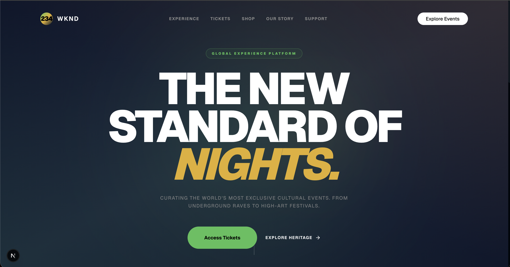

<div align="center">
  <h2 align="center">+234 WKND</h2>

A web experience built for <strong>music, culture, and unforgettable party nights</strong> in Nigeria 🇳🇬  
Designed to showcase events, vibes, and community around the +234 WKND movement.

Built with <strong>Next.js</strong> and <strong>Tailwind CSS</strong> for speed, performance, and clean UI.

<a href="#"><strong>➥ Live Demo Coming Soon</strong></a>
</div>

<br />

### 🎉 Demo Screenshots



### Prerequisites

Before you begin, ensure you have met the following requirements:

* [Git](https://git-scm.com/downloads "Download Git") must be installed on your operating system.

### Installing 234 WKND Web App

To install **234 WKND**, run this command on your git bash:

Linux and macOS:

```bash
sudo git clone https://github.com/rolandaayo/234-WKND.git
```

Windows:

```bash
git clone https://github.com/rolandaayo/234-WKND.git
```

## 💬 Contact

If you have an offer, opportunity, or introduction that might make my life more interesting, email me at ibiwoyeroland@gmail.com.

For the reasons stated above, I'll only respond to proposals that are matched for my schedule and interests.

### License

This project is **free to use** and does not contains any license.
